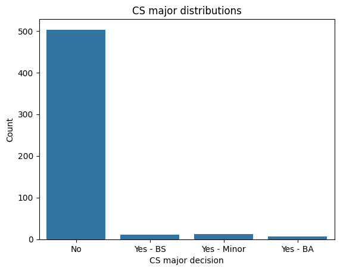
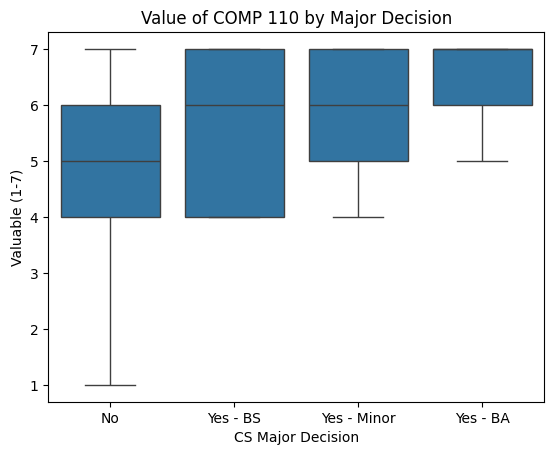
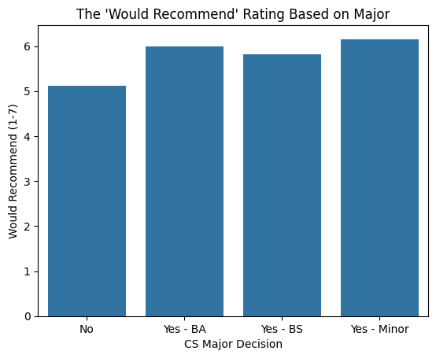

---
# Do not edit the text between these lines!
layout: default
---

# Final Assignment EX09
1. Idea to analyze with available data: The idea that I will analyze is "Do students who are not comp majors find this course valuable?" because both variable have clear data in the survey and have clear stakeholder values. The analysis will reveal how valuable COMP 110 is to non-comp majors, which can influence the decisions of the academic institution and the students themselves because they won't see a need to take this class. The functions defined in data_utils such as count can be easily applied to a data column such as comp_major since it is a yes/no question. I can use the variables: comp_major, valuable, interesting, would_recommend to gain more insight from the analysis. 

2. This idea is more valuable than the others brainstormed because: Since there are only two data variables to analyze in this data, the analysis and graphs will be more clear and clean and can hopefully show a promising relationship that has value to the stakeholders. I also believe that this idea also offers the most insight and value out of all the other ideas. 

<!-- This is a comment. Below, you'll see code for inserting an image. To make this image appear, update <custom-path>. To add an image, save it inside the imgs folder of this repository. -->

In conclusion, our data suggests that non-computer science majors generally do find COMP 110 to be a valuable course which further supports the idea that this course provides significant benefits beyond intended CS majors. However, when compared to CS majors (BA & BS) and minors, non-majors consistently rated COMP 110 slightly less valuable and were less likely to recommend the course than COMP major peers. This result indicates that while the course is broadly effective it still may be potentially challenging or unengaging to students without a computing background. Therefore, given these findings, I would recommend continuing to offer COMP 110 as an accessible course for non-majors, but with even more targeted adjustments to better support these students. Practical adjustment applications could include pre-lecture videos as discussed, additional scaffolding, exposure to more real-world applications of how coding is used in diverse fields, or optional beginner-focused resources to help improve perceived value among non-majors. Further, data from variables valuable and would_recommend support this recommendation, as they show a consistent but modest gap between majors and non-majors. 

Important trade-offs to consider include how implementing changes aimed at non-majors (e.g slow pace or more guided materials) could require additional time and funding from the department. Stakeholders such as instructors and course staff may also experience increased workload. To strengthen this analysis future extensions could explore collecting more detailed data on specifically why non-majors perceive COMP 110 less valuable, which would help refine specific improvements. For instance, additional survey questions pertaining to preferred learning styles could provide deeper insight. Secondly, tested interventions of collaborative assignments or pre-lecture videos could help determine what changes most effectively improve outcomes for non-majors. Lastly, analyzing performance data such as grades alongside perception data could provide a more complete understanding of student success. 